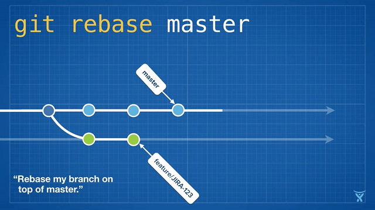

# REBASE

<!-- stolen from https://dzone.com/articles/the-2016-git-retrospective-rebase -->

For the purposes of keeping your PR clean, `rebase` is often used in place of a
`git merge origin/develop` or `git merge origin/master`.  It helps avoid merge
commits in the middle of your commit history.  For instance, in the following
scenario:

1.  You create a new branch based on `develop`:
    `git checkout mainline/develop && git checkout -b my-super-branch`.
2.  You make your changes and then commit them with
    `git commit -am 'super changes'`.
3.  In the meantime, someone pushes new commits to `develop`.

Here you have two options:

1.  `git fetch -a mainline && git merge mainline/develop`.  This will create a
    merge commit with all of the new changes, after the committed changes on
    your branch.  Your commit history will look something like:
    `develop -> my commits -> my commits -> merge develop -> my commits`
2.  `git fetch -a mainline && git pull --rebase mainline/develop`.  This will
    essentially uncommit your commits, pull down the develop with the new
    commits, and reapply your commits afterward.  Your commit history will look
    something like:
    `develop -> new develop -> my commits -> my commits`

This helps keep your commit history clean, but it also makes the next section,
`interactive rebase` a lot easier.

This is a destructive operation.  If you've pushed your branch somewhere and
someone else is using it, you rebase, and then push, it will mess with their
branch when they pull.
